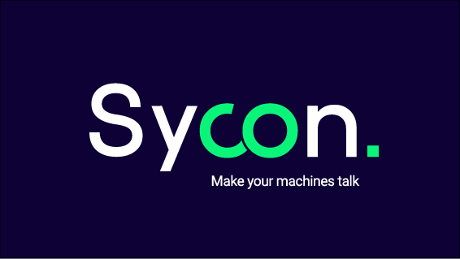

# SYCON — Launching the Future of Industrial Connectivity

> _Mission Control, this is Sycon. All systems are nominal. Ready for ignition._

Welcome aboard Sycon's GitHub base: the control room where we build, test, and launch the next generation of **sovereign industrial IoT** technologies.

We don't just collect data.  
We **orchestrate industrial intelligence** across machines, systems, environments, and operators, with one goal: **Bring real-time visibility and control to even the most isolated production lines**.

---

## Our Mission

In a world of legacy machines, siloed systems, and scattered sensors, Sycon builds the bridge:

- **Plug & Play connectivity** for any industrial asset — no retrofitting required
- **Real-time dashboards** and APIs to visualize, analyze, and integrate
- **Secure by design**, from the edge to the cloud (and on-prem if you prefer)
- **AI at the edge** to detect anomalies and unlock hidden patterns
- **Independent LTE/5G communication** — even offline, we keep talking

---

## Who We Are

Founded by ex-aerospace and defense engineers, Sycon is on a mission to:

> _Make industrial data accessible, actionable, and sovereign, one factory at a time._

We work with industrials, to bring tech on old production lines to increase performance and avoid waste of materials.

If your machines date from the Apollo era, don’t worry — we speak their language too.

---

## Ground Support

Need help connecting, testing or deploying?

Contact us at [contact@sycon.fr](mailto:contact@sycon.fr)

Or visit [our web site](https://sycon.fr) for mission briefings.

---

_“Connectivity is not the future of industry.  
It’s the **launchpad**.”_

— Team Sycon

